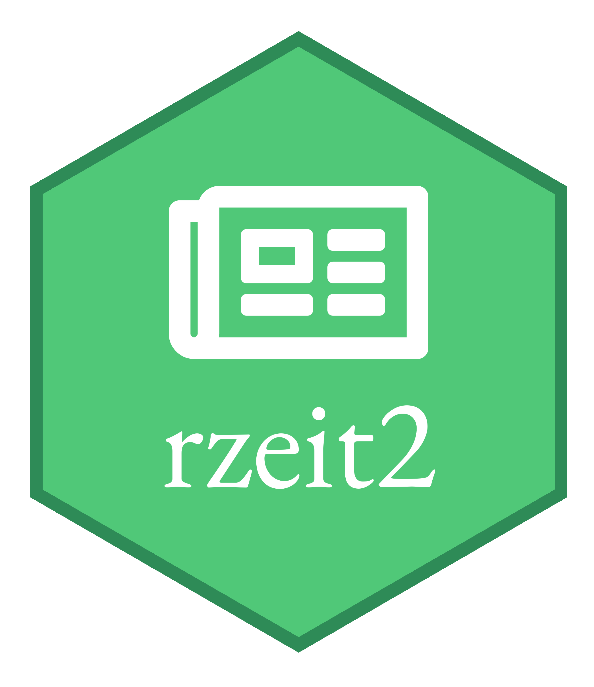

<!-- README.md is generated from README.Rmd. Please edit that file -->
rzeit2 
===========================================================

[](http://www.repostatus.org/#active) [](https://travis-ci.org/jandix/rzeit2) [](https://cran.r-project.org/package=rzeit2) [](https://cran.r-project.org/package=rzeit2)

Purpose / Description
---------------------

Client for the ZEIT ONLINE Content API - Interface to gather newspaper articles from *DIE ZEIT* and *ZEIT ONLINE*, based on a multilevel query.

This package is a lightweight successor of the [rzeit](https://github.com/jandix/rzeit) package. The main functions are completly rewritten using `httr`. Additionally the package provides a new functionality to directly download article texts using web scraping. Old grouping and visualisation functions are removed and will probably also rewritten in the future.

Status
------

The package is under development and will be extended with additional features in the future.

Installation
------------

### Stable Version

``` r
# install package from CRAN
install.packages("rzeit2")

# load package
library(rzeit2)
```

### Current Development Version

``` r
# install devtools package if it's not already
if (!requireNamespace("devtools", quietly = TRUE)) {
  install.packages("devtools")
}

# install package from GitHub
devtools::install_github("jandix/rzeit2")

# load package
library(rzeit2)
```

Authentication
--------------

``` r
# save the api key in the .Renviron file
set_api_key("xxx", "~/.Renviron")
```

Download meta data
------------------

``` r
tatort_articles <- get_content("Tatort",
                               begin_date = "20180101",
                               end_date = "20180131")
```

Download text
-------------

``` r
tatort_content <- get_article_text(tatort_articles$content$href, timeout = 1)
```

Download comments
-----------------

``` r
tatort_comments <- get_article_comments(tatort_articles$content$href[1], timeout = 1)
```

Download images
---------------

``` r
tatort_images <- get_article_images(tatort_articles$content$href, timeout = 1, download = "~/Documents/tatort-img/")
```

Authors
-------

Jan Dix <jan.dix@uni-konstanz.de>

Acknowledgements
----------------

Special thanks to [Simon Munzert](http://simonmunzert.github.io/), who helped me entering the world of R and GitHub. Additionally, I would like to thank **Peter Meißner** and **Christian Graul** who helped with the first version of this package. Lastly, I would like to thank **Jana Blahak** who wrote the documentation for the first package which is widely reused.
